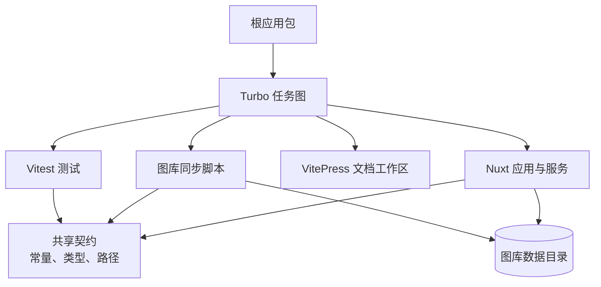
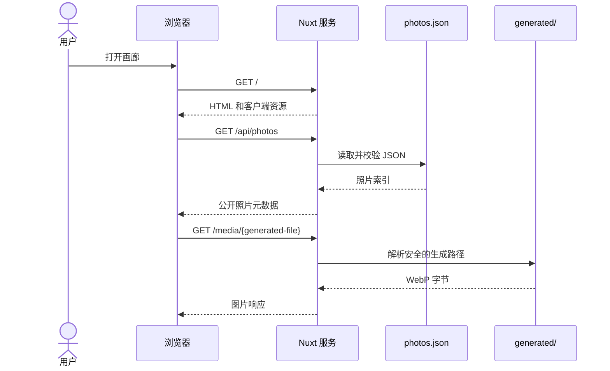
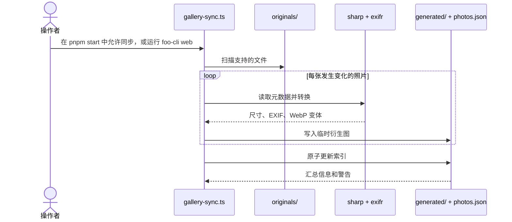

# 架构

Framefolio 按照数据边界和交付边界拆分。Nuxt 服务负责只读的画廊交付，同步脚本负责图片处理，根 package 负责应用运行时，文档工作区负责文档工具链。

## 依赖与接口关系

箭头表示重要接口：

- `shared` 定义服务与同步流程共享的路径和 JSON 契约。
- `scripts/gallery-sync.ts` 写入数据契约，服务负责读取。
- `docs` 记录契约和开发流程。
- Turbo 协调独立的构建、测试、类型检查和文档任务。

## 画廊请求路径

## 同步流程

## 安全规则

1. 从 `NUXT_GALLERY_DATA_DIR` 或默认的 `data/` 目录解析所有数据路径。
2. 将文件名和查询参数视为不可信输入。
3. 从磁盘读取前校验生成资源名称。
4. 先写入临时文件，再原子替换索引。
5. 保持原图位于公开服务输出目录之外。
