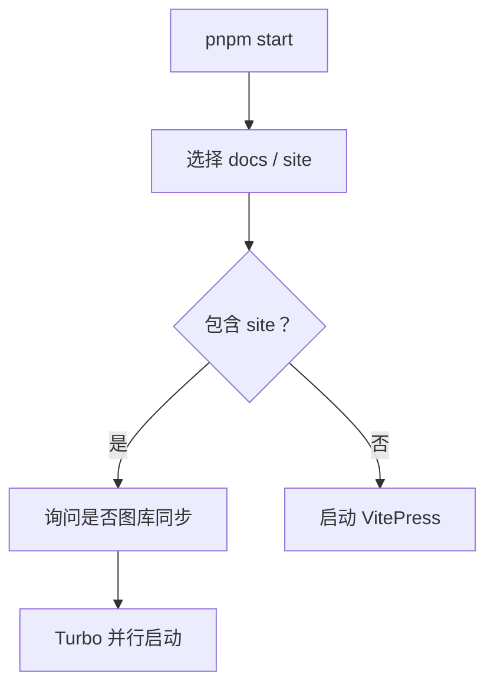
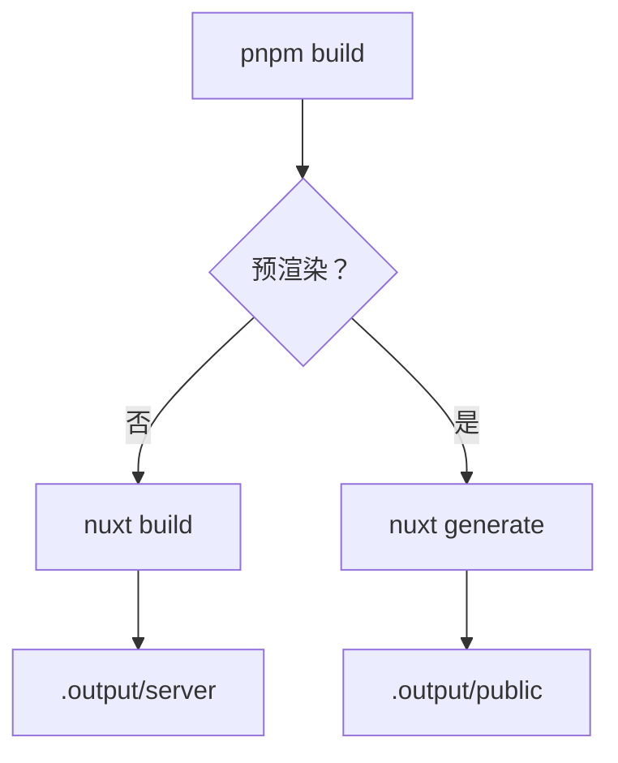
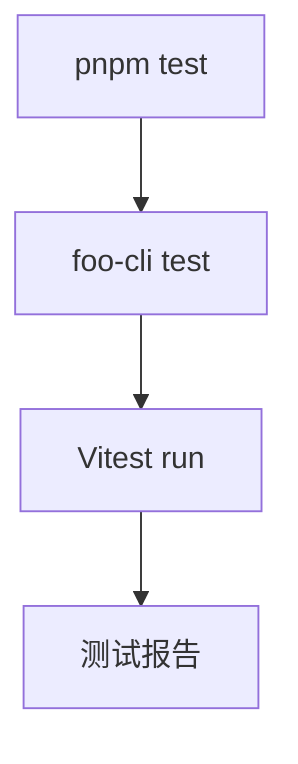
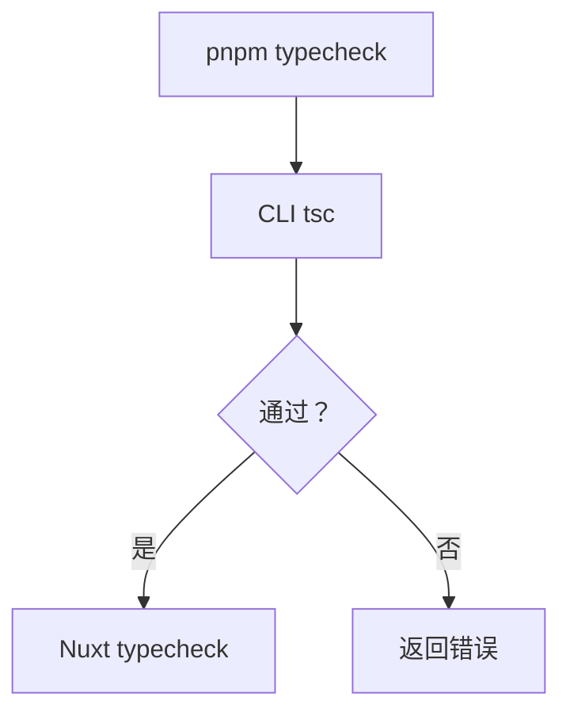
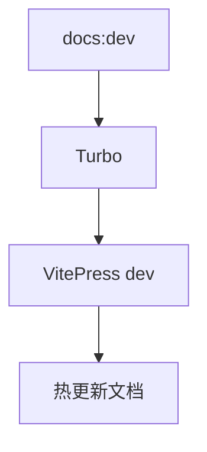
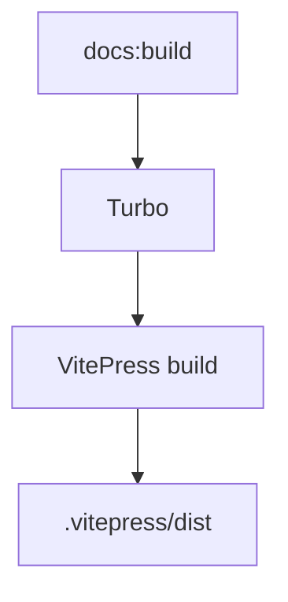
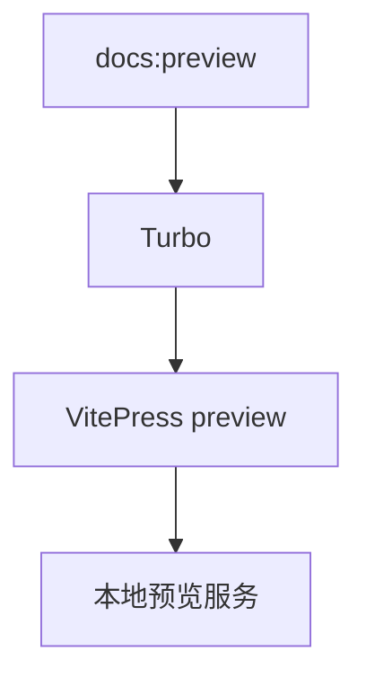
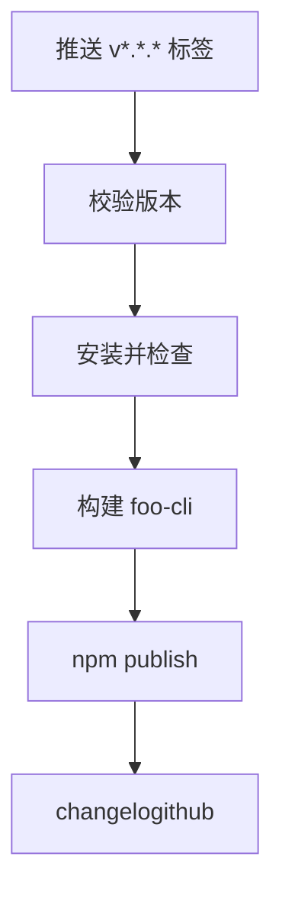
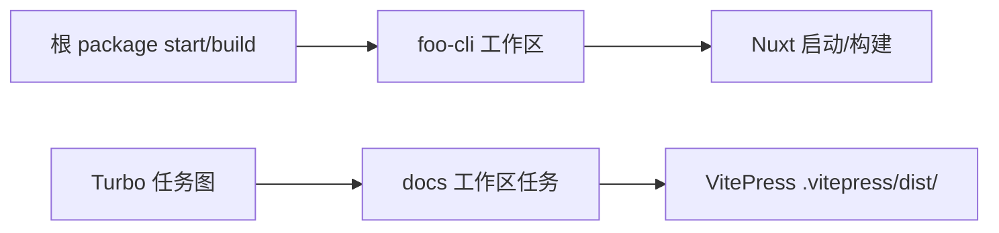

# 开发指南

## 前置要求

- Node.js 22.19+ 或 Node.js 24.11+
- 通过 Corepack 使用 pnpm 11
- Git

在仓库根目录安装依赖：

```bash
corepack enable
pnpm install
```

## 根目录命令

根目录 `package.json` 是面向使用者的命令入口。应用代码位于根目录，因为 Nuxt 应用是仓库中唯一的运行时 package。Turbo 负责任务编排，VitePress 工作区负责自己的文档任务。

| 命令 | 用途 |
| --- | --- |
| `pnpm start` | 启动选中的 Nuxt 站点和文档服务 |
| `pnpm build` | 构建 Nuxt 应用 |
| `pnpm test` | 运行 Vitest 测试 |
| `pnpm typecheck` | 执行 CLI 和 Nuxt 类型检查 |
| `pnpm exec turbo run docs:dev` | 启动带热更新的 VitePress |
| `pnpm exec turbo run docs:build` | 构建文档站 |
| `pnpm exec turbo run docs:preview` | 预览生成的文档 |

Turbo 使用 TUI 模式。自动化环境请使用 `CI=true`。

## 任务流程

下面的网格展示每个常用任务从根命令到实际执行器的路径。

:::: cards
::: card :rocket: 启动服务

:::
::: card :package: 构建应用

:::
::: card :check: 运行测试

:::
::: card :gear: 类型检查

:::
::: card :docs: 文档开发

:::
::: card :book: 构建文档

:::
::: card :search: 预览文档

:::
::: card :rocket: 发布

:::
::::

## Turbo 模型

根 package 是面向使用者的命令入口，其生命周期脚本通过 `pnpm exec` 委托给 `foo-cli`。VitePress 是一个真实的工作区 package，并在自己的 `package.json` 中注册 `docs:*` 任务。



## 规范驱动开发

行为变化使用 SDD（规范驱动开发）：


按以下流程执行：

1. 在 `docs/specs/` 中创建或更新文档。
2. 定义行为、数据契约、非目标和验收方式。
3. 当边界发生变化时更新架构图。
4. 实现最小且职责清晰的改动。
5. 执行 `pnpm typecheck`、`pnpm test` 和 `pnpm build`。
6. 发布前更新参考文档。

## 文档工作流

VitePress 使用卡片/网格 Markdown 插件和 Mermaid 绘制时序图、依赖图及接口图。新增架构变化或处理流程时，应同时补充相应图表。

```bash
pnpm exec turbo run docs:dev
```
