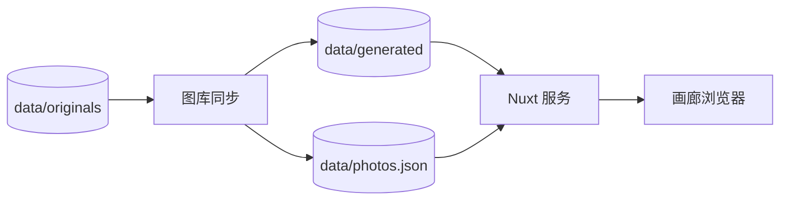

# 项目概览

Framefolio 是一个极简的自托管照片作品集。它扫描原图目录，提取有用的 EXIF 数据，生成 WebP 衍生图，并通过 Nuxt 提供响应式画廊。

## 产品边界

Framefolio 有意保持为画廊，而不是完整的照片管理套件。

- 不编辑原图。
- 不通过 HTTP 暴露原图。
- 不依赖数据库。
- 不接受浏览器上传。
- 无需重新构建应用即可重新生成衍生图。

## 运行流程

贡献者将文件放入 `data/originals/`，然后执行同步流程。管线会写入生成图片和索引，服务读取索引并将生成的 URL 映射到文件。



## 仓库结构

```text
framefolio/
├── app/                    # Nuxt UI 和画廊交互
├── server/                 # 照片 API 和生成资源路由
├── shared/                 # 共享常量、类型和路径规则
├── scripts/                # 图库同步源码
├── tests/                  # Vitest 单元测试
├── docs/                   # VitePress 文档工作区
├── package.json            # 应用脚本和根 Turbo 命令入口
├── pnpm-workspace.yaml     # 工作区成员配置
└── turbo.json              # 任务图和 TUI 配置
```

根 package 仍然是应用包。`docs` 工作区负责 VitePress 任务，根命令只负责委托给 Turbo。
