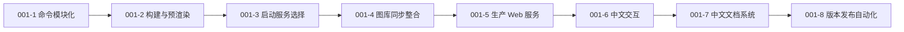
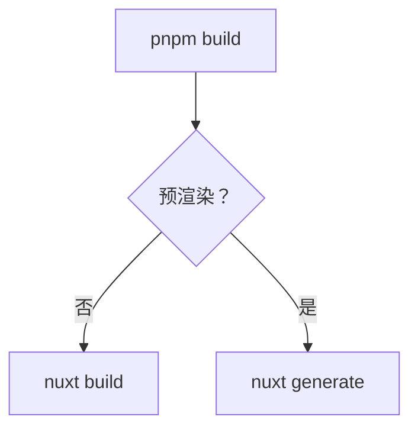
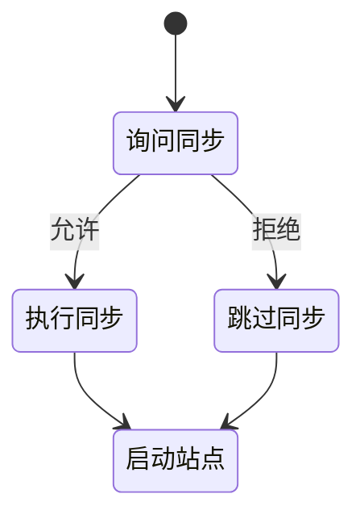
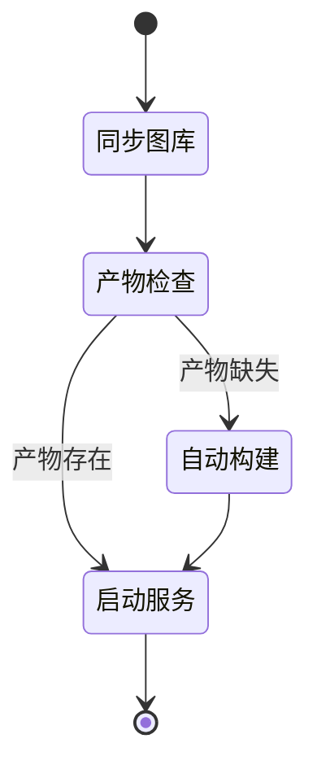
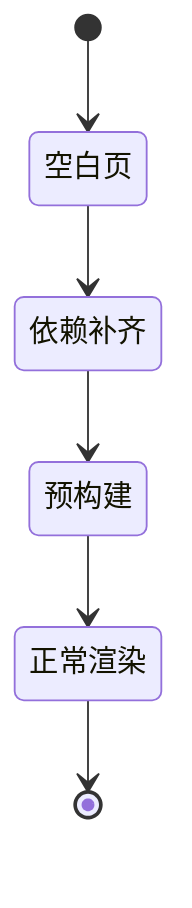
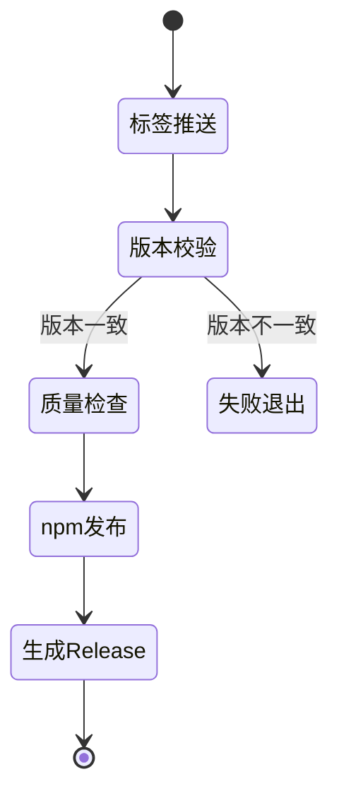

# 001 简洁画廊工具链

## 需求目标

本次迭代的全部需求统一记录在本篇文档中：把 Framefolio 打造成命令简洁、文档友好、发布自动化的自托管照片画廊工具。

## 需求内容

### 001-1 命令模块化

CLI 源码按入口、命令注册、共享动作拆分模块，每个命令独立文件。

### 001-2 构建与预渲染

`build` 只在需要时询问是否预渲染，默认服务端构建，支持 `--prerender` 和 `--yes`。

### 001-3 启动服务选择

`start` 提供 `docs` 和 `site` 两个选项，可并行启动，支持非交互参数。

### 001-4 图库同步整合

独立同步命令取消。站点启动时询问，`web` 自动同步。

### 001-5 生产 Web 服务

`web` 同步图库后检查构建产物，缺失时自动构建，再启动 Nitro 服务。

### 001-6 中文交互

CLI 的选择、确认、取消提示统一为中文。

### 001-7 中文文档系统

文档面向中文使用者，导航清晰，表达以图表优先；修复文档站空白页。

### 001-8 版本发布自动化

推送版本标签即可完成质量检查、npm 发布和 GitHub Release。

