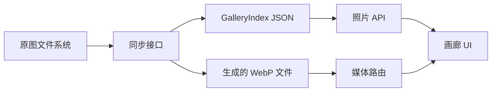

# 照片画廊规范

## 目标

为摄影师提供可靠、默认私有的画廊。原图文件夹无需数据库或浏览器上传流程，即可变成可浏览的作品集。

## 功能要求

### 原图和衍生图

- 接受 JPEG、PNG、TIFF 和 WebP 原图。
- 保留相对文件名作为公开展示文件名。
- 生成缩略图和更大尺寸的预览 WebP。
- 不通过服务路由暴露原图文件。
- 重复同步时跳过未变化的照片。
- 删除原图时，同时删除对应索引项和生成衍生图。

### 元数据

存在 EXIF 时，展示相机、镜头、焦距、光圈、快门速度、ISO 和拍摄日期。缺失 EXIF 字段不能阻止图片发布。

### 画廊交付

- `GET /api/photos` 返回经过校验的公开照片元数据。
- `/media/{filename}` 只提供经过校验的生成文件名。
- 界面适配桌面端和移动端宽度。
- 保留浅色和深色主题。

## 非目标

- 不编辑原图。
- 不提供用户账号或应用数据库。
- 不提供浏览器上传接口。
- 不自动备份到云端。

## 接口

## 验收检查

- 使用支持的 Node.js 版本时，干净检出可以完成构建。
- 测试套件覆盖布局、查看器、主题、运行时和同步行为。
- 空目录同步成功，并生成空索引。
- 媒体路由拒绝无效的生成文件名。
- VitePress 文档可以通过根目录 Turbo 命令构建。

## 变更策略

行为变化必须更新本规范，或记录为何不属于本规范范围。新增外部边界时，必须补充架构图，并在开发指南中增加验证步骤。
