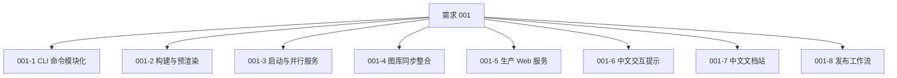
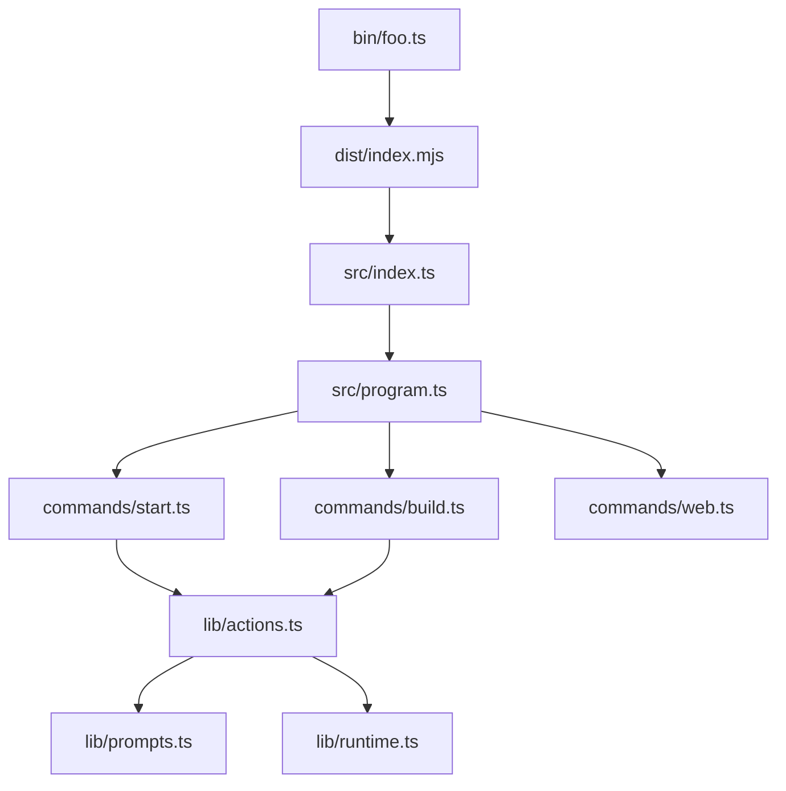
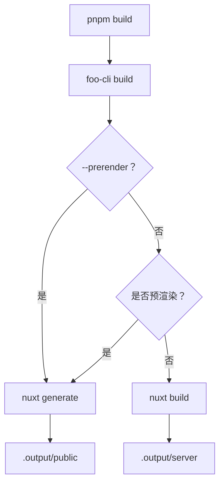
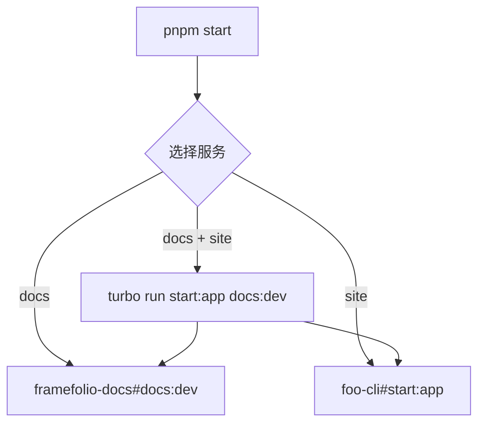
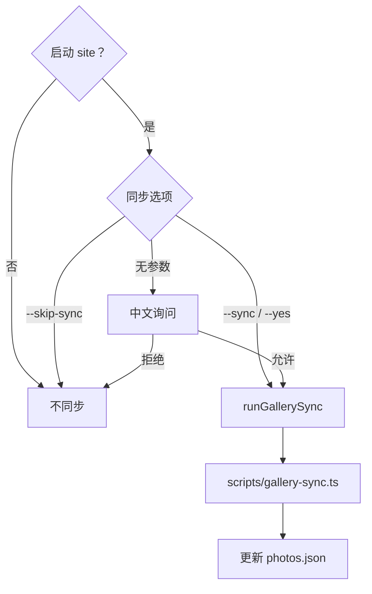
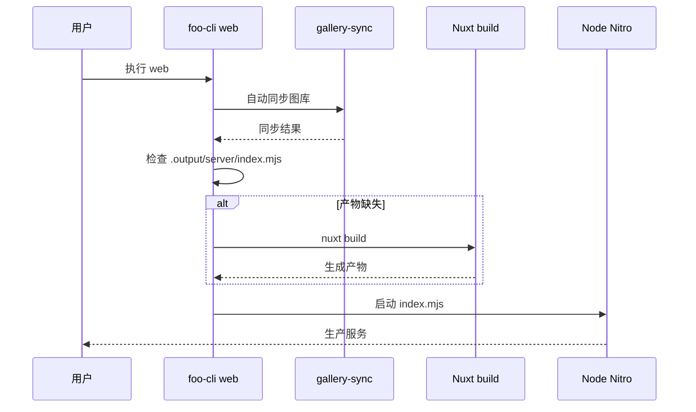
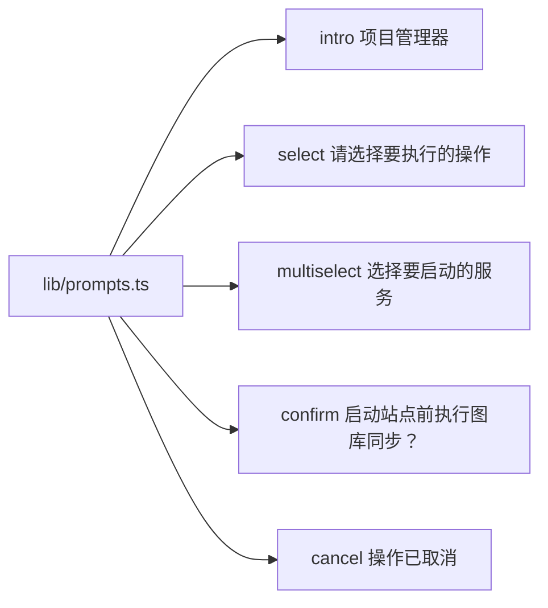
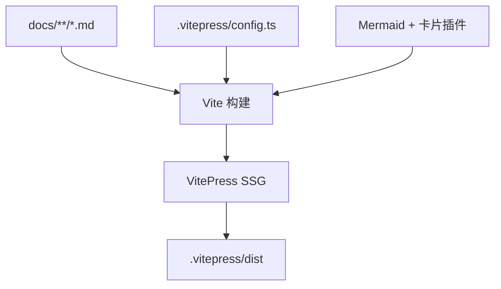
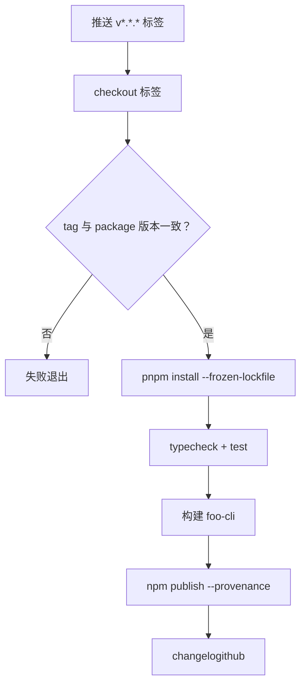
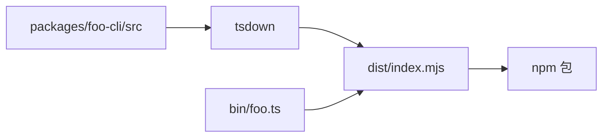

# 001 简洁画廊工具链任务拆解

关联需求：[001 简洁画廊工具链](/requirements/001-gallery-toolchain)

本次迭代的全部任务合并在本篇文档中，任务编号使用“需求编号-任务编号”与需求关联。

## 任务地图



## 001-1 CLI 命令模块化

关联需求编号：001-1

### 技术栈

| 依赖 | 用途 |
| --- | --- |
| Commander | 命令注册与参数解析 |
| @clack/prompts | 中文交互提示 |
| tsdown | 编译 TypeScript 为发布产物 |
| tsx | 直接运行 TypeScript bin 入口 |

### 实现



- `src/index.ts` 只导入命令模块并调用 `runProgram()`。
- `src/program.ts` 创建并导出 `Command` 实例。
- `commands/*.ts` 各自注册命令，互不依赖。
- `lib/actions.ts` 承载构建、启动、同步等共享动作。
- `lib/prompts.ts` 集中所有中文提示。
- `lib/runtime.ts` 统一子进程与工作目录处理。

## 001-2 构建与预渲染

关联需求编号：001-2

### 技术栈

| 依赖 | 用途 |
| --- | --- |
| Nuxt 4 | 应用构建 |
| Nitro | 服务端产物 |
| @clack/prompts | 预渲染询问 |

### 实现



- `build` 执行即构建，不再询问“是否构建”。
- 预渲染询问只在未传参数时出现，默认否。
- `--yes` 跳过询问，直接服务端构建。
- `--prerender` 直接生成静态资源。

## 001-3 启动与并行服务

关联需求编号：001-3

### 技术栈

| 依赖 | 用途 |
| --- | --- |
| Commander | `--docs` / `--site` / `--preview` / `--yes` 参数 |
| @clack/prompts | 多选与确认 |
| Turborepo | 并行运行持久任务 |
| VitePress / Nuxt | 文档与站点开发服务 |

### 实现



- 交互模式使用多选框，默认选中 `site`。
- `--docs --site` 非交互并行启动。
- `--yes` 默认启动站点。
- `--preview` 通过 `FOO_CLI_PREVIEW` 环境变量传递，Turbo 配置 `passThroughEnv`。

## 001-4 图库同步整合

关联需求编号：001-4

### 技术栈

| 依赖 | 用途 |
| --- | --- |
| sharp | 生成 WebP 衍生图 |
| exifr | 读取 EXIF 元数据 |
| tsx | 运行同步脚本 |
| @clack/prompts | 站点启动同步询问 |

### 实现



- 删除独立 `gallery:sync` 命令、根目录脚本及相关文档引用。
- `lib/gallery.ts` 提供 `runGallerySync()`，内部调用 `pnpm exec tsx scripts/gallery-sync.ts`。
- `start` 只在选择 `site` 时询问；仅启动文档不询问。
- `web` 不询问，直接同步。

## 001-5 生产 Web 服务

关联需求编号：001-5

### 技术栈

| 依赖 | 用途 |
| --- | --- |
| Nitro | 生产服务运行时 |
| Node.js | 运行 `.output/server/index.mjs` |
| Commander | `--host` / `--port` 参数 |

### 实现



- 默认地址 `127.0.0.1:3123`，可用 `--host` / `--port` 覆盖。
- 通过 `NITRO_HOST` / `NITRO_PORT` 环境变量传给 Nitro 入口。
- 同步失败时进程以非零状态退出，不启动服务。

## 001-6 中文交互提示

关联需求编号：001-6

### 技术栈

| 依赖 | 用途 |
| --- | --- |
| @clack/prompts | intro / select / multiselect / confirm / cancel |

### 实现



- 操作选择：`请选择要执行的操作`（启动 / 构建）
- 服务选择：`选择要启动的服务`（docs / site）
- 同步确认：`启动站点前执行图库同步？`
- 预渲染确认：`是否将页面预渲染为可部署的静态资源？`
- 构建完成：`Framefolio 构建完成。`
- 取消：`操作已取消。`

## 001-7 中文文档站

关联需求编号：001-7

### 技术栈

| 依赖 | 用途 |
| --- | --- |
| VitePress | 静态文档框架 |
| vitepress-plugin-mermaid | Mermaid 图表 |
| @rooom/vitepress-plugins | 卡片 / 网格插件 |
| custom.css | 自定义样式与响应式网格 |

### 实现



- 站点设置 `lang: 'zh-CN'`，导航、侧边栏、Hero 文案全部中文。
- 导航结构：指南 / 需求清单 / 任务列表 / 参考 / 规范。
- 空白页修复：显式声明 `cytoscape`、`fastdom`、`dayjs`、`debug` 等运行依赖，并加入 `vite.optimizeDeps.include`。


## 001-8 发布工作流

关联需求编号：001-8

### 技术栈

| 依赖 | 用途 |
| --- | --- |
| GitHub Actions | 标签触发 CI |
| pnpm | 安装与脚本执行 |
| changelogithub | 生成 Release 日志 |
| NPM_TOKEN | npm 发布凭证 |

### 实现



- 工作流文件：`.github/workflows/release.yml`，触发条件 `on.push.tags: ['v*.*.*']`。
- 发布前校验标签版本与 `packages/foo-cli/package.json` 完全一致。
- npm 发布启用 `--provenance`，Release 日志由 `changelogithub` 自动生成。

### 发布产物



## 验证

```bash
pnpm typecheck
pnpm test
pnpm exec turbo run docs:build
```
